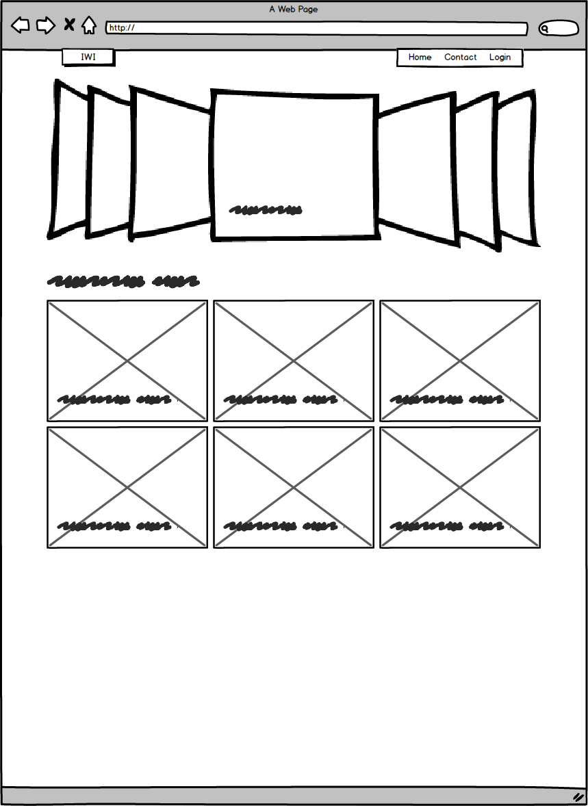
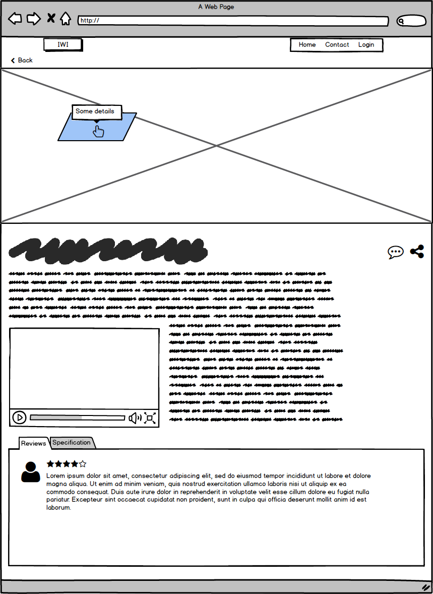
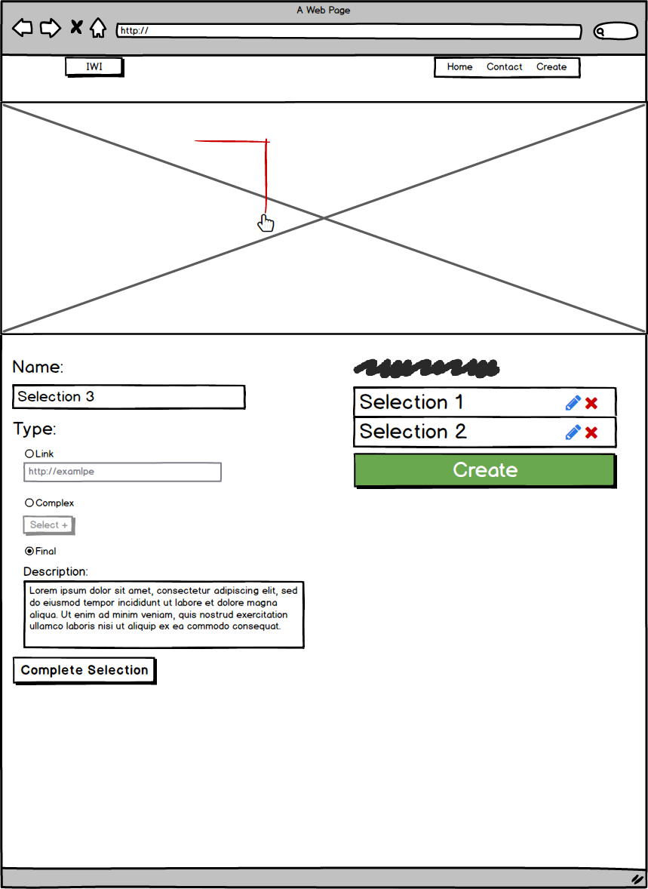
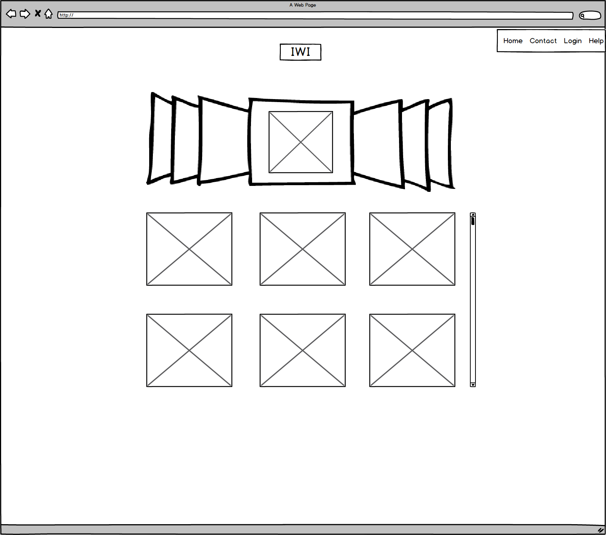
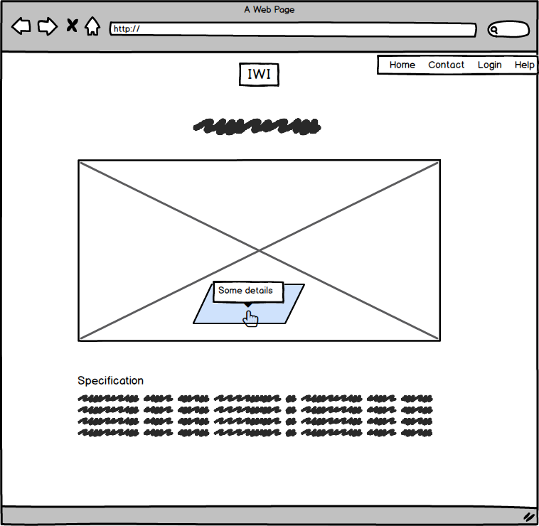
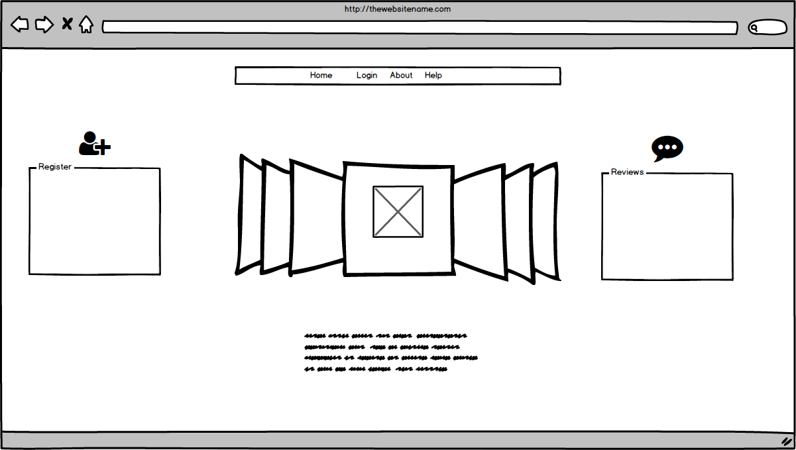
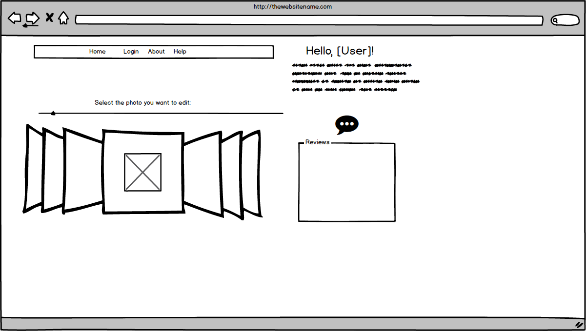

<html>
	

		<h1>QOC</h1> 	
		<h2>Reviews & Specification</h2>
		<table class="table">
			<thead>
				<tr>
					<th></th>
					<th>Tabs Bar</th>
					<th>Blocks</th>
					<th>Slider</th>
				</tr>
			</thead>
			<tbody>
				<tr>
					<th>Resonsive</td>
					<td>10</td>
					<td>10</td>
					<td>8</td>
				</tr>
				<tr>
					<th>UX</td>
					<td>9</td>
					<td>6</td>
					<td>7</td>
				</tr>
				<tr>
					<th>Content Saving</td>
					<td>10</td>
					<td>4</td>
					<td>10</td>
				</tr>
				<tr>
					<th>Total</td>
					<td><strong>29</strong></td>
					<td><strong>20</strong></td>
					<td><strong>5</strong><td>
				</tr>
			</tbody>
		</table>
		 
		<h2>Main Image</h2>
		<table class="table">
			<thead>
				<tr>
					<th></th>
					<th>Image Map</th>
					<th>SVG</th>
					<th>Canvas</th>
				</tr>
			</thead>
			<tbody>
				<tr>
					<th>Resonsive</td>
					<td>9</td>
					<td>9</td>
					<td>10</td>
				</tr>
				<tr>
					<th>UX</td>
					<td>7</td>
					<td>7</td>
					<td>10</td>
				</tr>
				<tr>
					<th>Ease of Implementation</td>
					<td>9</td>
					<td>9</td>
					<td>3</td>
				</tr>
				<tr>
					<th>Functionality</td>
					<td>6</td>
					<td>7</td>
					<td>9</td>
				</tr>
				<tr>
					<th>Total</td>
					<td><strong>31</strong></td>
					<td><strong>32</strong></td>
					<td><strong>32</strong><td>
				</tr>
			</tbody>
		</table>
		 
		<h2>Display Most Recent Images</h2>
		<table class="table">
			<thead>
				<tr>
					<th></th>
					<th>Responsive grid display</th>
					<th>Accordion</th>
					<th>Single image per row</th>
				</tr>
			</thead>
			<tbody>
				<tr>
					<th>Resonsive</td>
					<td>10</td>
					<td>9</td>
					<td>3</td>
				</tr>
				<tr>
					<th>UX</td>
					<td>10</td>
					<td>10</td>
					<td>6</td>
				</tr>
				<tr>
					<th>Ease of Implementation</td>
					<td>8</td>
					<td>7</td>
					<td>10</td>
				</tr>
				<tr>
					<th>Functionality</td>
					<td>10</td>
					<td>10</td>
					<td>7</td>
				</tr>
				<tr>
					<th>Total</td>
					<td><strong>38</strong></td>
					<td><strong>36</strong></td>
					<td><strong>26</strong><td>
				</tr>
			</tbody>
		</table>
		

			<h3>1. Home page</h3>
			

				
			

		

		

			<h3>1. Product page</h3>
			

				
			

		

		

			<h3>1. Admin page</h3>
			

				
			

		

		

			<h3>2. Home page</h3>
			

				
			

		

		

			<h3>2. Product page</h3>
			

				
			

		

		

			<h3>3. Home page</h3>
			

				
			

		

		

			<h3>3. Admin page</h3>
			

				
			

		
		
	

</html>
